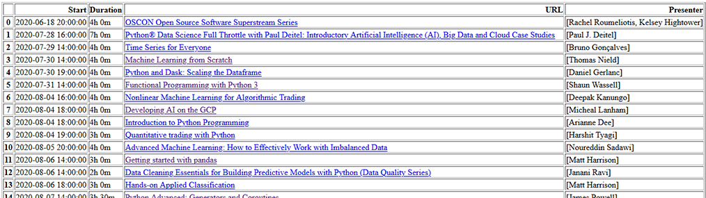

# oreilly-search

The **learning.oreilly.com** page has a lot of online trainings listed and they mostly hosted on the **event.on24.com** platform.
But because of this, you only have limited search abilities on the oreilly platfom. You can search for events in the next 7, 60 or 180 days, without using any search string, so this is more like a browse all content possibility.

If you want to search for example for the string *"Python"*, then you get the result, but you can't sort for starting date-time and this makes it really hard to choose something for a set of free period you have.

The **oreilly_search.py** will help in creating a list with a search string in an ordered fashion, from which, you can easily choose something for a specified date. It calculates the duration of the session and creates an HTML file with the requested data. Example of the result HTML below:

